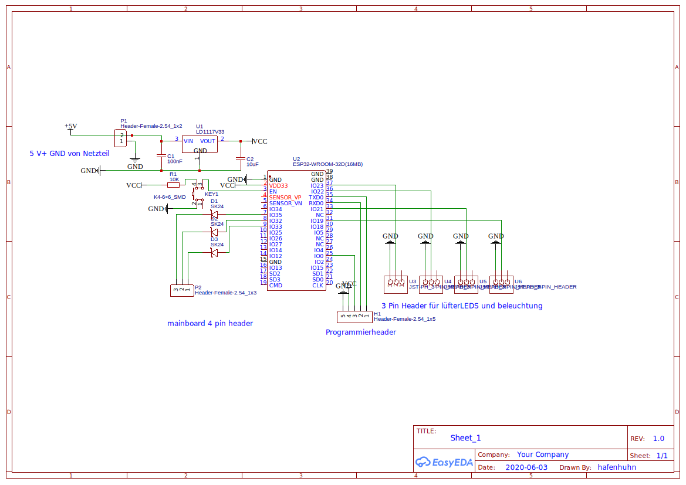
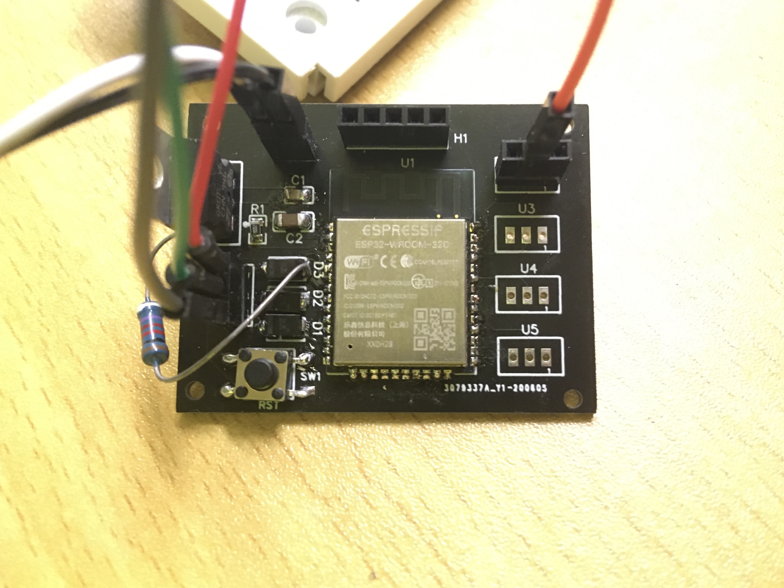

## MainboardLed2WS2812

Set WS2812 color based on 4-pin PWM RGB LED inputs (as found on mainboards). More FPS!

Currently a flat color is set. In the future animations and a WiFi interface is planned.

Hardware design made by @Hafenhuhn, Software written by @M4GNV5.

## Hardware

See [the EasyEDA project](https://easyeda.com/hafenhuhn/4pin-to-3-pin_copy) for the latest version.

